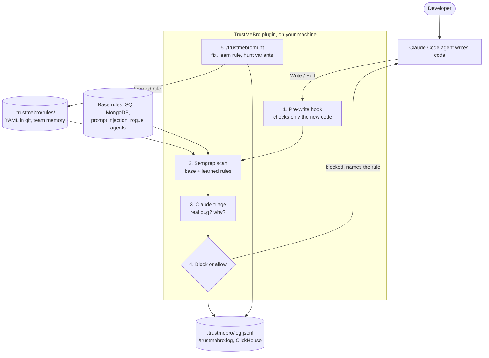

# TrustMeBro

> Shift left was a start. TrustMeBro catches it the moment it's written.

A Claude Code plugin that blocks vulnerable code as your AI agent writes it, fixes it, and turns each bug into a Semgrep rule that finds its siblings.

## Architecture

Semgrep catches it, Claude judges it, TrustMeBro remembers it. Learned rules are kept only if they match the bug and not the fix. The plugin installs uv and Semgrep itself.



## Install

In Claude Code:

```
/plugin install trustmebro --marketplace divyachandana/trustmebro
```

Paste your Anthropic API key when asked. That's it. The first session takes about 15 seconds while the plugin sets up Semgrep and its dependencies.

To change the key later:

```
/plugin configure trustmebro@trustmebro
```

## Use

| You do | TrustMeBro does |
|---|---|
| Let Claude write code as usual | Blocks any Write/Edit that adds a vulnerability and tells Claude how to fix it |
| Run `/trustmebro:hunt` | Scans the repo, fixes a bug, learns a rule from it, and finds similar bugs |

Learned rules are saved in `.trustmebro/rules/`. Commit them so your whole team gets them.

## Try it

```
git clone https://github.com/divyachandana/TrustMeBroDemo
cd TrustMeBroDemo
claude
```

Then follow [DEMO.md](https://github.com/divyachandana/TrustMeBroDemo/blob/main/DEMO.md).

## Update

```
/plugin marketplace update trustmebro
```

Then restart Claude Code.

## Logs

Every catch, fix and learned rule is appended to `.trustmebro/log.jsonl` in your project. To see them, run this in Claude Code:

```
/trustmebro:log
```

Or query the file with ClickHouse itself, with no account needed:

```bash
clickhouse local -q "SELECT ts, path, line, rule_id, blocked FROM file('.trustmebro/log.jsonl') WHERE kind = 'findings' ORDER BY ts DESC"
```

To also send events to a ClickHouse Cloud service, add `CLICKHOUSE_HOST` and `CLICKHOUSE_PASSWORD` (from the service's **Connect** panel) to your project's `.env`, then use the queries in [docs/clickhouse-queries.sql](docs/clickhouse-queries.sql).

## Develop

```bash
brew install uv semgrep
uv sync --extra dev
uv run pytest
uv run python scripts/demo.py ../TrustMeBroDemo/app.py
```
